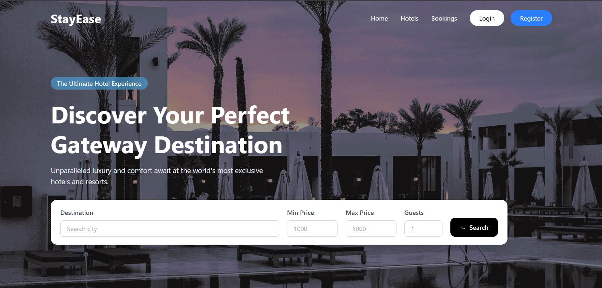
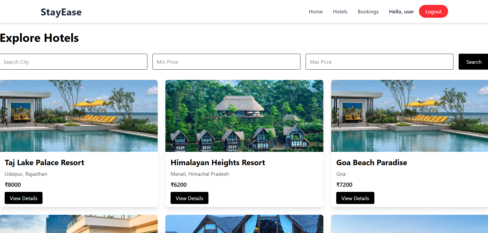
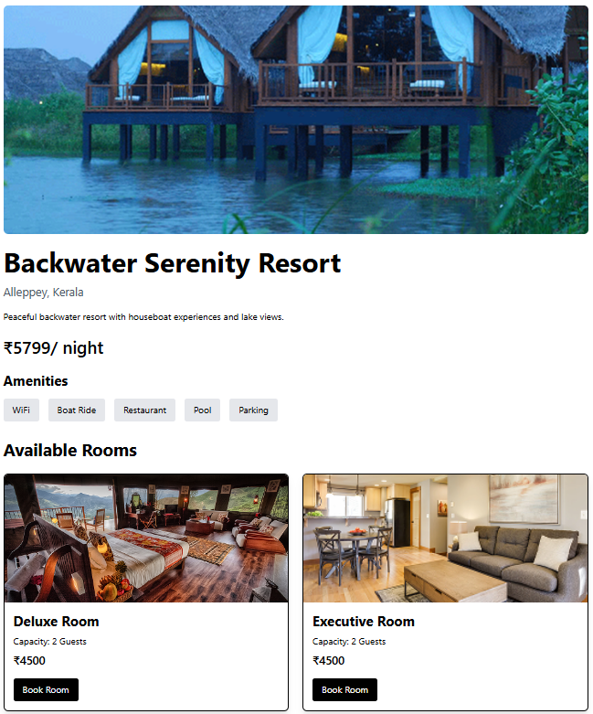
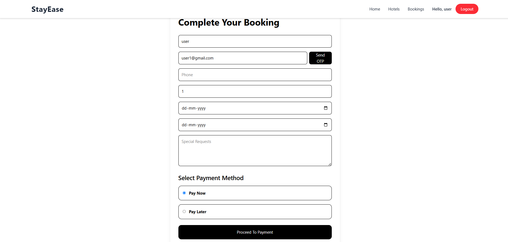
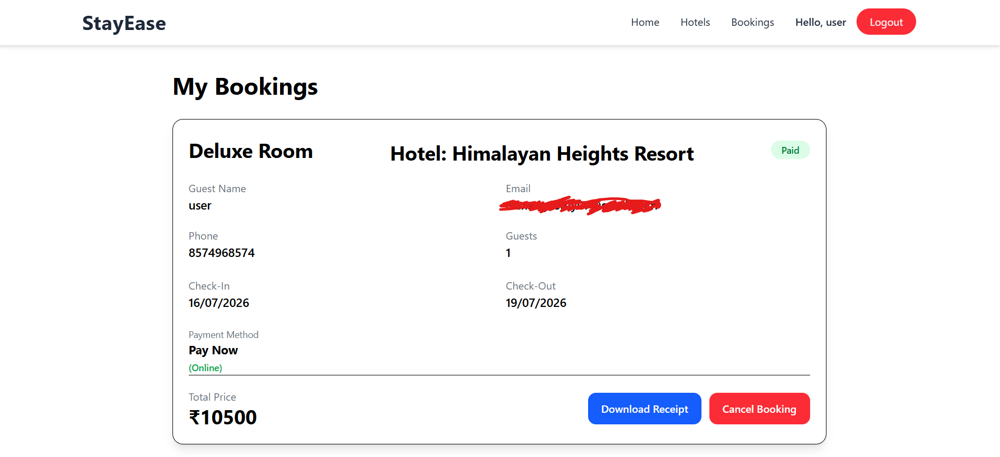
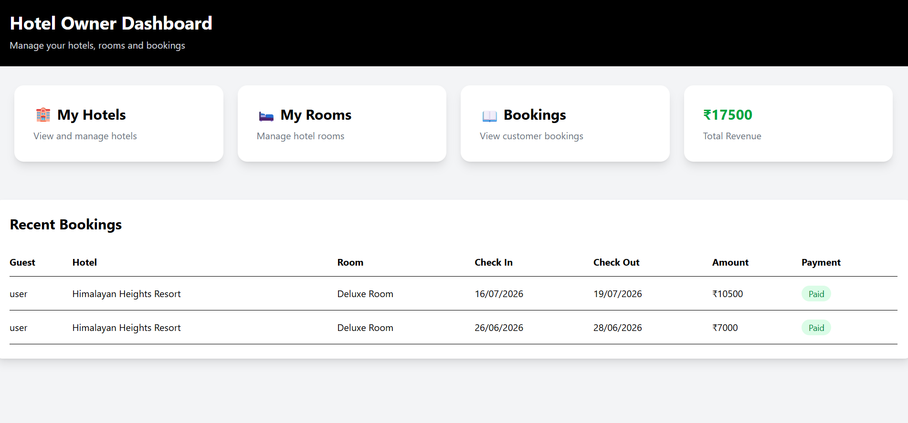
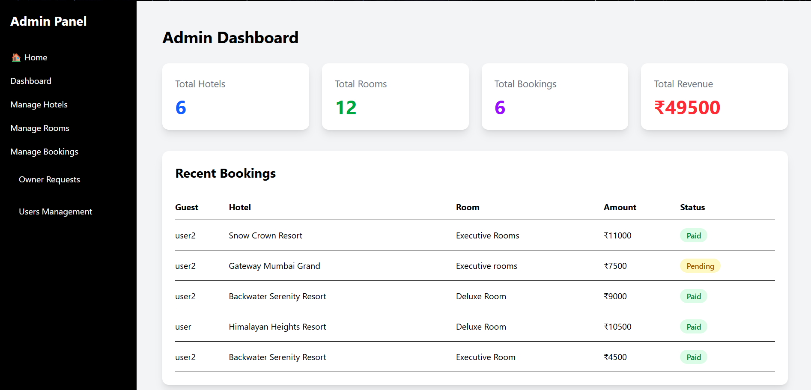

#  StayEase – Hotel Booking Platform

StayEase is a full-stack MERN Hotel Booking web application that allows users to search hotels, book rooms, make secure payments, and receive booking confirmation emails. It also provides separate dashboards for hotel owners and administrators to manage hotels, rooms, and bookings.

---

##  Live Demo

**Frontend:** https://stay-ease-hotel-booking.vercel.app

**Backend API:** https://stay-ease-hotel-booking.onrender.com

---

##  Features

###  User
- User Registration & Login
- OTP Email Verification (Brevo)
- Browse Hotels
- View Hotel Details
- Book Rooms
- Razorpay Payment Integration
- Booking Confirmation Email
- View My Bookings
- Cancel Bookings

###  Hotel Owner
- Hotel Owner Dashboard
- Add/Edit/Delete Hotels
- Add/Edit/Delete Rooms
- View Bookings
- Revenue Statistics

###  Admin
- View All Hotels
- View All Bookings
- Manage Users
- Manage Hotel Owner Requests

---

## Tech Stack

### Frontend
- React.js
- Vite
- React Router
- Axios
- Tailwind CSS

### Backend
- Node.js
- Express.js
- MongoDB
- Mongoose
- JWT Authentication
- Multer

### Integrations
- Razorpay
- Brevo Email API
- Render
- Vercel

---

## Project Structure

```
hotel-booking/
│
├── client/
│
├── server/
│
└── README.md
```

---

## Installation

### Clone Repository

```bash
git clone https://github.com/alexaugusthy7/Stay-Ease_hotel-booking.git
```

### Install Client

```bash
cd client
npm install
npm run dev
```

### Install Server

```bash
cd server
npm install
npm start
```

---

## Environment Variables

### Server

Create a `.env` file inside the `server` folder.

```env
PORT=

MONGODB_URI=

JWT_SECRET=

BREVO_API_KEY=

RAZORPAY_KEY_ID=

RAZORPAY_KEY_SECRET=
```

### Client

Create a `.env` file inside the `client` folder.

```env
VITE_API_URL=
```

---

##  Screenshots

###  Home Page



###  Hotels Page



###  Hotel Details



###  Booking Page



###  My Bookings



###  Owner Dashboard



###  Admin Dashboard



## Future Improvements

- Cloudinary Image Storage
- Hotel Search Filters
- Wishlist
- Booking History
- User Profile
- Ratings & Reviews

---

##  Author

**Alex Augusthy**

Email: alexaugusthy97@gmail.com

GitHub: https://github.com/alexaugusthy7
